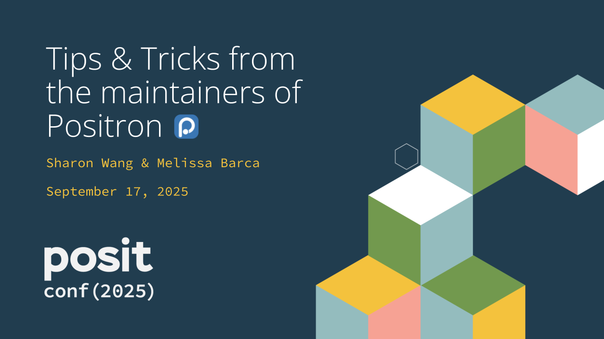

# Tips & Tricks from the maintainers of Positron

This repo hosts [Sharon Wang](https://github.com/sharon-wang) and [Melissa Barca](https://github.com/melissa-barca)'s posit::conf(2025) talk content for "Tips & tricks from the maintainers of Positron", presented at posit::conf(2025) on September 17, 2025 in Atlanta, GA, USA.

## Recording

TBD!

## Abstract

Positron is Posit’s next-generation IDE for data science. Finding your groove in a new IDE takes time, so we’ve got some tips and tricks to help you feel more at home in Positron!

We’ll cover key navigation concepts, helpful features for different workflows, and configuration settings for a pleasant IDE experience. Plus, we’ll show you how to explore what Positron is doing under the hood – so you can understand it more deeply and solve problems with confidence.

Whether you’re just getting started or already using Positron, these tips will help you settle into your data science workflow and get the most out of everything Positron has to offer.

## Slides

- [PDF Slides](./Tips&TricksFromTheMaintainersOfPositron_Slides.pdf)
- [PPTX Slides](./Tips&TricksFromTheMaintainersOfPositron_Slides.pptx)
- [Plaintext Slides](./Tips&TricksFromTheMaintainersOfPositron_Plaintext.txt)

### Videos

Videos embedded in the slides:

- [✨ Spontaneous theme change](./media/change_theme.mp4)
- ["Sea of editor tabs"](./media/open_editors.mp4)
